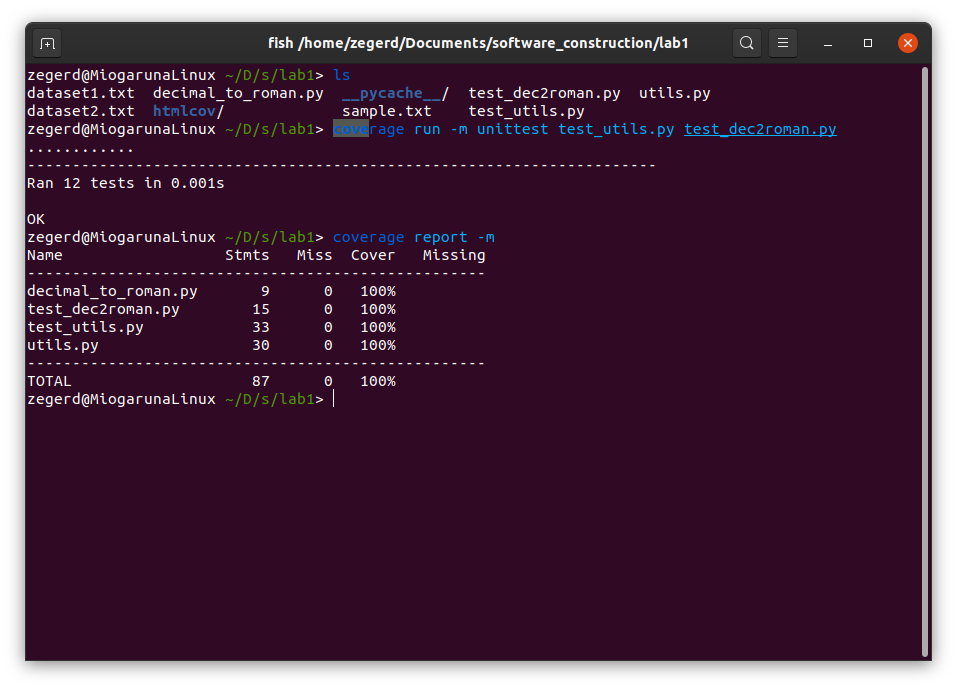
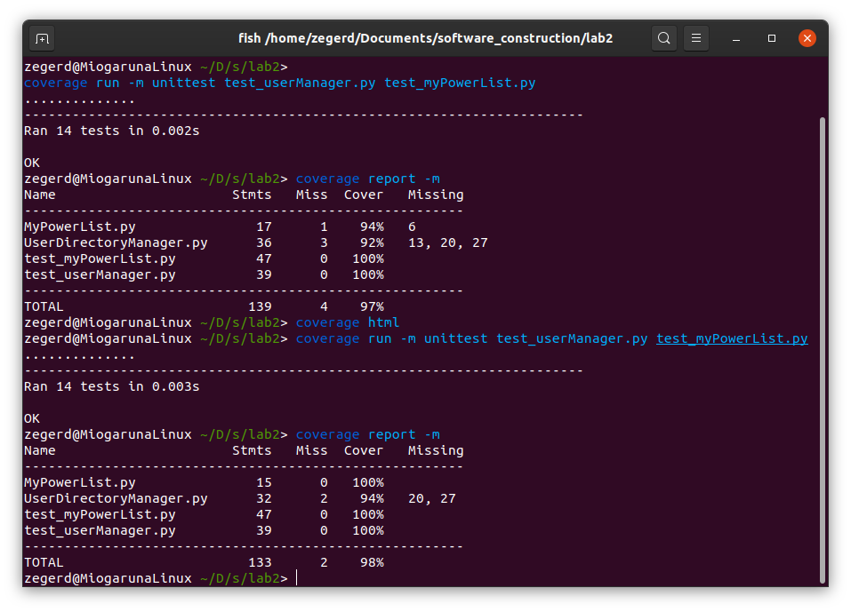
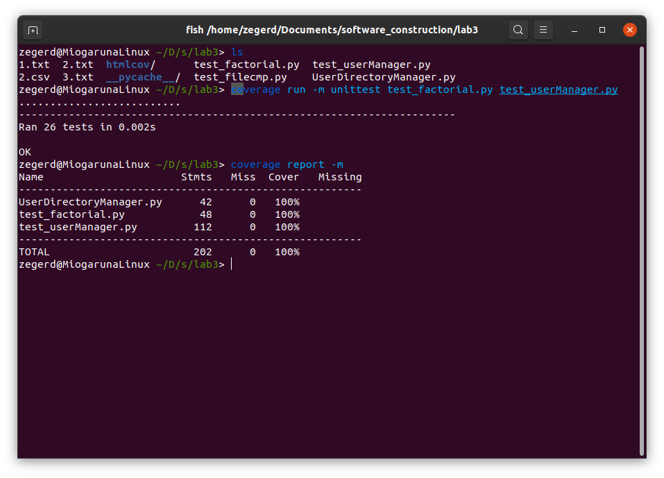

# Lab 4: Coverage Tests and PEP8 formating

Use python PEP8 linting and add unit test with coverage testing to previous labs

## How to run coverage

```shell
~$ coverage run -m unittest {unit_test}.py # where `unit_test` is your testfile
~$ coverage report -m
~$ coverage html
```

## Coverage examples

### Coverage Test on Lab 1



### Coverage Test on Lab 2



### Coverage Test on Lab 3


